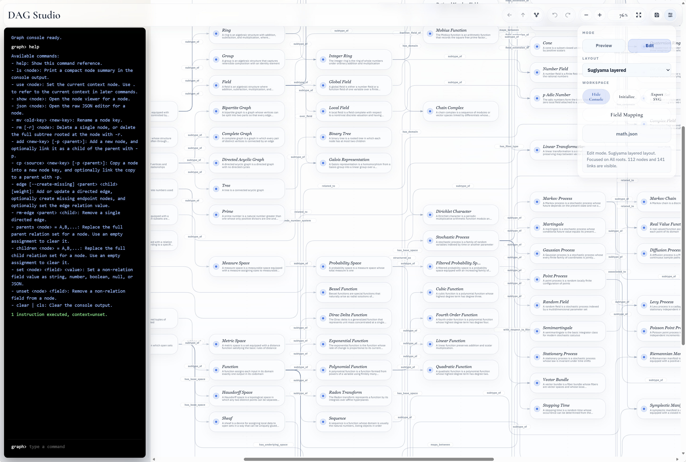

# Math Knowledge Graph

> Understand not only what a mathematical concept means, but where it belongs.

Math is a living, graph-structured knowledge base for mathematics. It combines human-readable notes with a directed concept graph, making definitions, properties, and structural relationships visible in one workspace.

Traditional notes explain ideas one page at a time, but often hide how those ideas fit together. This project keeps both views: **Markdown explains each concept; the graph reveals the larger mathematical structure.**

## How It Works

| Layer | Role | Main question |
| --- | --- | --- |
| **Concept notes** | Definitions, formulas, properties, examples, and remarks | What is this concept? |
| **Knowledge graph** | Direct relationships between mathematical objects | Where does it sit in mathematics? |
| **DAG Studio** | Visual exploration, editing, synchronization, and optional AI assistance | How can I explore and maintain it? |

The current workspace contains more than 100 pure-mathematics concepts across foundations, algebra, analysis, geometry, topology, and probability.

One path through the graph, for example, is:

> [`Set`](./content/Set.md) → [`Topological Space`](./content/Topological_Space.md) → [`Hausdorff Space`](./content/Hausdorff_Space.md) → [`Manifold`](./content/Manifold.md) → [`Differential Manifold`](./content/Differential_Manifold.md) → [`Riemannian Manifold`](./content/Riemannian_Manifold.md)

Each step can be explored as both a graph node and a complete mathematical note.

## What You Can Do

With DAG Studio, you can:

- explore the graph by root, branch, parent level, or focused concept;
- read full Markdown and LaTeX content without leaving the graph;
- create, rename, connect, and remove concepts interactively;
- undo and redo graph changes;
- apply batch operations through the graph console;
- open a concept's source note in Typora;
- optionally ask an AI provider to inspect the graph or propose validated, reviewable changes.

Graph edits are written to [`content/math.json`](./content/math.json). Creating, renaming, or deleting a node also keeps its matching Markdown file aligned with the workspace.

## Quick Start

DAG Studio requires Python 3 and Node.js with npm. Typora is optional and is only needed for opening source notes from the Studio.

Launch it from the repository root:

- **Windows:** double-click [`launch-studio.cmd`](./launch-studio.cmd)
- **macOS:** run [`launch-studio.command`](./launch-studio.command)

The first launch installs the Studio's frontend dependencies automatically and opens the local workspace in your browser.

If you prefer to read without running the Studio, start with [`Set`](./content/Set.md), [`Logic`](./content/Logic.md), or [`Relation`](./content/Relation.md).

## Scope

The project has one core and two extension layers:

- **Core — pure mathematics:** [`content/`](./content/) contains the concept notes and the structural graph explored by DAG Studio.
- **Applied mathematics:** [`applied mathematics/`](./applied%20mathematics/) organizes problem-oriented material such as algorithms, differential equations, geometry, optimization, and statistics.
- **Formal proofs:** [`proof/`](./proof/) contains machine-checkable proofs alongside the broader knowledge base.

Supporting components live outside the mathematical content:

- [`studio/`](./studio/) contains the visual graph workspace;
- [`rules/`](./rules/) defines which concepts and relationships belong in the graph;
- [`rules/scripts/`](./rules/scripts/) contains synchronization, lookup, validation, and maintenance tools;
- [`history/`](./history/) preserves historical graph artifacts.

## Design Principles

- **Concepts first.** Each note focuses on one reusable mathematical object or object class.
- **Structure stays sparse.** The graph keeps direct, meaningful relationships instead of every possible semantic connection.
- **Depth stays in the notes.** Theorems, methods, proofs, and extended explanations remain readable Markdown content.
- **Tools serve the knowledge.** Studio, scripts, and AI assistance exist to make the mathematical structure easier to explore and maintain.

## Further Reading

- [`studio/README.md`](./studio/README.md) — DAG Studio usage and development
- [`rules/Math Concept Graph.md`](./rules/Math%20Concept%20Graph.md) — graph purpose and design principles
- [`rules/Math Concept Node Policy.md`](./rules/Math%20Concept%20Node%20Policy.md) — when a concept should become a node
- [`rules/Math Concept Edge Policy.md`](./rules/Math%20Concept%20Edge%20Policy.md) — which relationships belong in the graph
- [`rules/scripts/ReadMe.md`](./rules/scripts/ReadMe.md) — synchronization, validation, and maintenance tools
