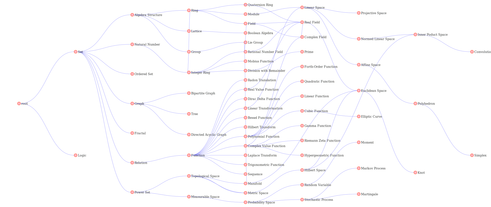

# $Mathematic\ Library$

[TOC]

## Introduction

- **Mathematics** is a formal language grounded in axioms and logical reasoning.
- **Applied mathematics** involves solving pure mathematical problems or mathematical problems derived from simplified models.
- **Physics** is the study and description of natural phenomena through systematic observations, experiments, and the formulation of mathematical models to understand and predict the behavior of matter, energy, space, and time in a repeatable and consistent manner.
- **Engineering** is the construction of systems that serve human society based on proven knowledge.

## Math



### Note Format

- **Name**: Take a mathematical entity as a note.
- **Define**: The definition of this concept.
- **Properties**: The important properties of this concept.
- **Include**: Subsets of this concept.
- **Parents**: The higher layer concepts of this concept.


### Knowledge Graph of Nodes

- If a hyperlink appears in the definition `Definie`, it indicates that it is the parent node of this concept.
- Other hyperlinks that appear are child nodes of this concept.
- All concepts together form a directed acyclic graph.
- Specific implementation reference `./admin/`

### Operations

#### Markdown $\to$ Graph (Json)

```
curl --location 'http://localhost:5000/function' \
--header 'Content-Type: application/json' \
--data '{
    "function": "build_markdown_from_graph",
    "params": {
        "json_file": "C:/Algo/Notes/math_physics/math/lib/math.json"
    }
}'
```

#### Graph (Json) $\to$ Markdown

```
curl --location 'http://localhost:5000/function' \
--header 'Content-Type: application/json' \
--data '{
    "function": "build_graph_json_from_markdown_folder",
    "params": {
        "folder_path": "C:/Algo/Notes/math_physics/math/"
    }
}'
```

## Physics

- Basic principles of mechanics

  - The Principle of Least Action
  - Symmetry: Noether's theorem

- Spacetime
  - Absolute spacetime

    $S = \int \left(\frac{m v^2}{2} - U(\boldsymbol r, t)\right) \mathrm dt  \tag{particle}$

  - Flat spacetime

  - Curved spacetime

    $S=-\frac{1}{c}\int L_m \sqrt{-g} \mathrm d^4x + \frac{c^3}{16\pi G}\int R\sqrt{-g} \mathrm d^4x$
  
- Field
  - Electromagnetic field

    $S = \sum\int mc \mathrm ds - \sum \int \frac{e}{c} A_k \mathrm dx^k - \frac{1}{16 \pi c} \int F_{ik}F^{ik} \mathrm d \Omega$

  - Quantum field

  - Gravitational field

- Complex System
  - Fluid

    $ρ \left(\frac{∂\boldsymbol v}{∂t} + (\boldsymbol v · ∇) \boldsymbol v \right) =  - ∇ P  + ρ \boldsymbol f + η ∇^2 \boldsymbol v + \left(ζ + \frac{η}{3} \right) ∇ (∇ · \boldsymbol v)$

  - Statistics
