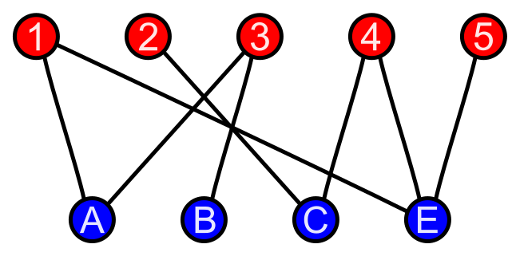

# Bipartite Graph

[TOC]

## Define

> A bipartite graph is a graph whose vertices can be split into two parts so that every edge connects the two parts.

$$
(X, Y, E)  \tag{Bipartite Graph}
$$
$$
X, Y \cap \varnothing, X \cup Y = V  \tag{vertex sets}
$$
$$
E \sube  X \times Y\tag{edge set}
$$

For a Bipartite Graph, The vertex set $V$ of a graph is divided into two disjoint subsets $X, Y$. And, edges in Bipartite Graph only exist between point sets $X, Y$, not within them. The weights of edges can be represented by
$$
f: X\times Y \to S
$$

## Properties

- Representation, a bipartite graph can be represented by a matrix $M \in S^{m \times n}$ with each value $M_{ij}$ refer to the edge weight between $x_i$ and $y_j$, where $m$ is the element number of $X$ and $n$ is that of $Y$.
  $$
  f:(X \times Y) \to S \quad\Longrightarrow\quad S^{m \times n}
  $$

### Maximum Matching
The maximum matching of bipartite graphs equivalents to a network flow model. Connect the source point to all points on the left and all points on the right to the sink, with a capacity of $1$. The original edge is connected from left to right, with a capacity of $1$. The maximum flow is the maximum match. 

#### Kuhn-Munkres Algorithm

#### Hopcroft-Karp Algorithm

