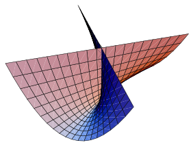
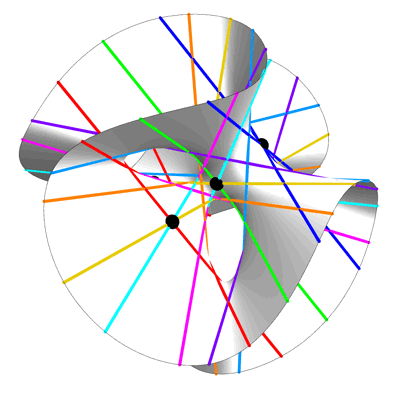

# Cubic Function

[TOC]

## Define

> A cubic function is a polynomial function whose highest-degree term has degree three.

$$
\begin{align*}
f(x) &= \sum_{i=0}^{3} a_i x^i  \tag{Univariate} \\
f(\boldsymbol x) &= \sum\limits_{i_1=0}^{\dim} \sum\limits_{i_2=i_1}^{\dim} \sum\limits_{i_3=i_2}^{\dim}a_{i_1 i_2 i_3} \cdot x_{i_1} x_{i_2} x_{i_3}  \quad \text{where } x_0 = 1 \\
\end{align*}
$$

## Properties

### Univariate Cubic Equation

For the general cubic equation
$$
ax^3+bx^2+cx+d=0,\qquad a\neq0
$$

Then the solutions are
$$
x_k=-\frac{1}{3a}
\left(
b+\omega^k C+\frac{\Delta_0}{\omega^k C}
\right),
\qquad k=0,1,2
$$

$$
\left\{\begin{align*}
\Delta_0 &= b^2-3ac,\\
\Delta_1 &= 2b^3-9abc+27a^2d,\\
C &= \sqrt[3]{\frac{\Delta_1+\sqrt{\Delta_1^2-4\Delta_0^3}}{2}}\\
\omega&=\frac{-1+i\sqrt3}{2}
\end{align*}\right.
$$

#### Cardano Form

If $C=0$, the expression is interpreted via the equivalent Cardano form or its limiting case. Then the solutions are

$$
x_k=
-\frac{b}{3a}
+
\omega^k
\sqrt[3]{-\frac{q}{2}+\sqrt{
\left(\frac q2\right)^2+\left(\frac p3\right)^3}}
+
\omega^{-k}
\sqrt[3]{-\frac{q}{2}-\sqrt{
\left(\frac q2\right)^2+\left(\frac p3\right)^3}},
\quad k=0,1,2
$$

$$
\left\{\begin{align*}
p&=\frac{3ac-b^2}{3a^2}\\
q&=\frac{2b^3-9abc+27a^2d}{27a^3}\\
\Delta&=\left(\frac q2\right)^2+\left(\frac p3\right)^3\\
\omega&=e^{2\pi i/3}=\frac{-1+i\sqrt3}{2}
\end{align*}\right.
$$

#### Depressed cubic equation

For a special univariate cubic equation called depressed cubic equation,
$$
x^3 + px + q = 0
$$

The solutions are,
$$
r = \sqrt[3]{-\frac{q}{2}+\sqrt{\left(\frac{q}{2}\right)^2+\left(\frac{q}{2}\right)^3}}+\sqrt[3]{-\frac{q}{2}-\sqrt{\left(\frac{q}{2}\right)^2+\left(\frac{q}{2}\right)^3}}
$$

### Cubic Surface, Cubic Equation

$$
\left\{\boldsymbol x \ \Bigg|\ \sum\limits_{i_1=0}^{\dim} \sum\limits_{i_2=i_1}^{\dim} \sum\limits_{i_3=i_2}^{\dim}a_{i_1 i_2 i_3} \cdot x_{i_1} x_{i_2} x_{i_3}, \text{where } x_0 = 1 \right\}
$$

Property:

- There are exactly 27 straight lines on each smooth cubic algebraic surface in the complex field.

#### Fermat Cubic

$$
\left\{ x \ \Bigg|\ \sum_{i = 1}^{\dim} x_i^3 = 0 \right\}
$$

#### Whitney Umbrella

$$
x^2 z -a y^2 = 0
$$

$$
\left\{\begin{align*}
x &= uv\\
y&= u\\
z &= v^2
\end{align*}\right.
$$

#### Clebsch Diagonal Cubic

$$
x^3 + y^3 + z^3 + w^3 + (x + y + z + w)^3 = 0
$$

Clebsch diagonal cubic is a hyperplane cross-section in the complex projective space $\mathbb {P}^4$. It is the only smooth cubic surface with all 27 real lines in the real number field.

#### Ding-Dong surface

$$
x^2+y^2+z^3-z^2=0
$$

