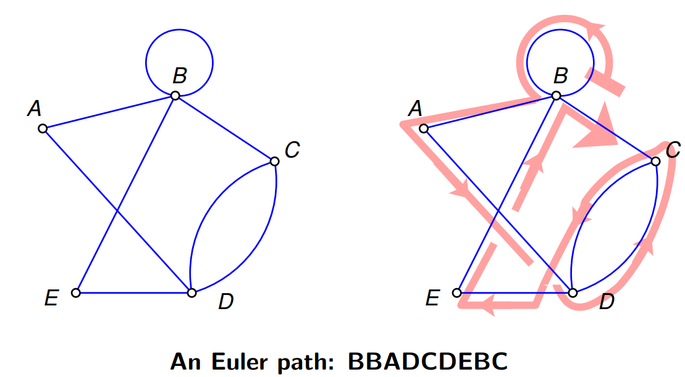

# Graph

[TOC]

## Define

> A graph is a structure made of vertices and edges that records pairwise relationships.

$$
G=(V,E)
$$

A graph is a pair, where $V$ is a set of vertices and $E$ is a set of edges connecting vertices.

1. Undirected graph,

$$
E\subseteq \big\{\{u,v\}\mid u,v\in V,\ u\neq v\big\}.
$$

2. Directed graph,

$$
E\subseteq V\times V.
$$

Thus an undirected edge $\{u,v\}$ has no direction, while a directed edge $(u,v)$ points from $u$ to $v$.

### Weighted Graph

$$
w:E\to S
$$

A weighted graph is a graph equipped with a weight function. Weights are extra data; they are not part of the definition of a bare graph.
- $S$: the weights, usually is $\mathbb R$ or $\mathbb R_{\ge 0}$.

## Properties

### Adjacency

**Adjacency.** Two vertices are adjacent if they are connected by an edge. 

- For a simple undirected graph, $u$ and $v$ are adjacent if $\{u,v\}\in E$.

- For a directed graph, $u$ points to $v$ if $(u,v)\in E$.

**Neighborhood.** For a vertex $v$, the neighborhood of $v$ is the set of vertices adjacent to $v$.
$$
\begin{align*}
N(v)&=\{u\in V \mid \{u,v\}\in E\} \\
N^+(v) &=\{u\in V \mid (v,u)\in E\} \\
N^-(v) &=\{u\in V \mid (u,v)\in E\}
\end{align*}
$$

**Degree.** In an undirected graph, the degree of a vertex is the number of edges incident to it. In a directed graph, the in-degree and out-degree of a vertex $v$ are
$$
\begin{align*}
\deg(v) &= |N(v)|\\
\deg^+(v)&=|N^+(v)| \\
\deg^-(v)&=|N^-(v)|
\end{align*}
$$

Properties,

- An **isolated vertex** is a vertex with no incident edges $\deg(v)=0$

- A **pendant vertex** (or **leaf**) is a vertex incident to exactly one edge $\deg(v)=1$

- $$
  \frac12 \sum_{v\in V} \deg(v) = \sum_{v\in V} \deg^+(v) = \sum_{v\in V} \deg^-(v) = 2 |E|
  $$

- $k$-regular graph, defined by $\deg(v) = k, \forall v \in V$.

### Representation by Adjacency Matrix

Edges of a finite graph can be representation by a matrix $A\in S^{n\times n}$ called adjacency matrix. For a simple undirected graph, the adjacency matrix is symmetric.

- For an unweighted graph,

$$
A_{ij}=
\begin{cases}
1, & \quad  \exists \{v_i,v_j\}\in E,\\
0, & \quad  \text{otherwise.}
\end{cases}
$$

- For a weighted graph, when the edge exists.

$$
A_{ij}=w(v_i,v_j)
$$
### Path

A walk is a sequence of vertices $(v_0,v_1,\cdots,v_k)$ such that consecutive vertices are connected by edges $\{v_i,v_{i+1}\}\in E \text{  or  } (v_i,v_{i+1})\in E$.

- **Trail** is a walk in which no edge is repeated but vertices may still be repeated.
- **Path** is a walk in which no vertex is repeated. $v_i\neq v_j, \forall i\neq j$

**Distance.** The **distance** between $u$ and $v$, denoted by $d(u,v)$, is the length of a shortest $u$-$v$ path. If no path exists between $u$ and $v$, then commonly $d(u,v)=\infty$.
$$
d(u,v)=\min\{|P|:P\text{ is a }u\text{-}v\text{ path}\}
$$

#### Connectivity

An undirected graph is connected if every pair of vertices is joined by a path. A directed graph is strongly connected if for every pair of vertices $u,v\in V$, there is a directed path from $u$ to $v$ and a directed path from $v$ to $u$.

#### Acyclicity

A graph is acyclic if it has no cycle. For directed graphs, acyclicity means there is no directed cycle.

#### Euler Path, Euler Graph

An Euler path is a path that passes through every edge exactly once. If such a path starts and ends at the same vertex, it is called an Euler circuit. A graph with an Euler circuit is called Eulerian.

For a connected undirected graph:

- It has an Euler circuit if and only if every vertex has even degree.
- It has an Euler path but not an Euler circuit if and only if exactly two vertices have odd degree.

### Subgraph

A graph $H=(V_H,E_H)$ is a **subgraph** of $G=(V,E)$ if $V_H\subseteq V, E_H\subseteq E$ with every edge in $E_H$ having both endpoints in $V_H$.

Special subgraphs,

- Induced Subgraph, $V_H \subseteq V, E_H = \{\{u,v\}\in E \mid u,v \in H\}$, contains all edges of $G$ whose endpoints both belong to $H$.
- Spanning Subgraph, $V_H = V, E_H\subseteq E$, keeps all vertices but may contain only some of the edges.

### Graph Isomorphism

Two graphs $G=(V_G,E_G)$ and $H=(V_H,E_H)$ are **isomorphic **$G\cong H$, if there exists a bijection $f:V_G\to V_H$ such that adjacency is preserved as follows $\forall u,v\in V_G$.
$$
\{u,v\}\in E_G \iff \{f(u),f(v)\}\in E_H
$$
An **automorphism** of a graph $G=(V,E)$ is an isomorphism from the graph to itself $f:V\to V$, such that preserves adjacency $\{u,v\}\in E \iff \{f(u),f(v)\}\in E$.

### Matching of Graph

A matching in a graph is a set of edges no two of which share a common endpoint:
$$
M\subseteq E,
\quad
e_i\cap e_j=\varnothing
\quad
(e_i\neq e_j).
$$

**Maximum Matching.** A maximum matching is a matching with the largest possible number of edges:
$$
M^*=\arg\max_M |M|.
$$

**Perfect Matching.** A perfect matching is a matching that covers every vertex of the graph.
