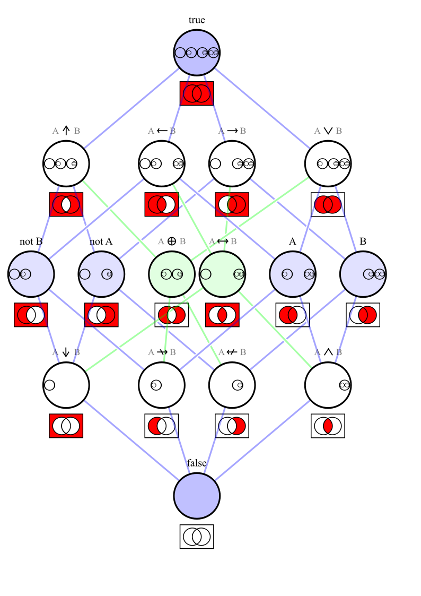

# Logic

[TOC]

## Define

> Logic studies formal languages, truth conditions, and inference rules for valid reasoning.

A logical system specifies:

- **Syntax**: which symbolic expressions are well-formed formulas. Syntax describes the formal symbols and formation rules of a logical language.
- **Semantics**: when formulas are true under an interpretation.
- **Proof system**: which formal inference rules are allowed.

$$
\Gamma\models\varphi
\quad\text{and}\quad
\Gamma\vdash\varphi.
$$

- $\Gamma$ is a set of formulas and $\varphi$ is a formula.
- $\Gamma\models\varphi$ means $\varphi$ is a semantic consequence of $\Gamma$.
- $\Gamma\vdash\varphi$ means $\varphi$ is formally derivable from $\Gamma$.

## Properties

### Syntax

#### Basic Concepts

The **truth constants** are:

- true: $\top$
- false: $\bot$

**Variables** represent arbitrary objects:
$$
x,y,z,\cdots
$$

**Constants** represent fixed objects:
$$
a,b,c,\cdots
$$

**Predicates** represent properties or relations:
$$
P(x),\quad R(x,y),\quad S(x_1,\cdots,x_n).
$$

**Quantifiers** bind variables and express quantity over a domain of discourse:

- Universal quantifier: $\forall x\,\varphi(x)$. It states that the property $\varphi(x)$ holds for all elements in the domain.
- Existential quantifier: $\exists x\,\varphi(x)$. It states that at least one element in the domain satisfies the property.
- Unique existence quantifier: $\exists!x\,\varphi(x)$. It states both that such an element exists and that no other element satisfies the property.

#### Proposition

A proposition is a statement that has a truth value: true or false. In formal logic, one usually works with formulas. A proposition may be understood as a formula with a determined truth value, or as a closed formula in a given interpretation.

#### Logical Connectives

Logical connectives combine formulas into larger formulas:

- Negation: $\neg\varphi$. It reverses the truth value of $\varphi$. If $\varphi$ is true, then $\neg\varphi$ is false, and vice versa.
- Conjunction: $\varphi\wedge\psi$. It is true only when both $\varphi$ and $\psi$ are true.
- Disjunction: $\varphi\vee\psi$. It is true when at least one of $\varphi$ or $\psi$ is true. It is false only when both are false.
- Implication: $\varphi\rightarrow\psi \equiv \neg \varphi \vee \psi$. It is false only when $\varphi$ is true and $\psi$ is false.
- Equivalence: $\varphi\leftrightarrow\psi \equiv (\varphi \rightarrow \psi)\wedge(\psi \rightarrow \varphi)$. It is true when $\varphi$ and $\psi$ have the same truth value—both true or both false.

#### Contrapositive

$$
\neg Q \rightarrow \neg P.
$$

**Contrapositive:** For an implication $P \rightarrow Q$, the contrapositive is if $Q$ is false, then $P$ must also be false. An implication and its contrapositive are logically equivalent:
$$
P\rightarrow Q \equiv \neg Q\rightarrow \neg P
$$

### Semantics

Semantics assigns meaning and truth values to formulas.

An **interpretation** gives meanings to the non-logical symbols of a language. It specifies:

- a domain of discourse;
- the objects denoted by constants;
- the relations denoted by predicates;
- the functions denoted by function symbols, if the language has them.

A **model** is an interpretation in which a formula or a set of formulas is true. The notation means that the formula $\varphi$ is true in the model $\mathcal M$.

$$
\mathcal M\models\varphi
$$
For a set of formulas $\Gamma$, means that every formula in $\Gamma$ is true in $\mathcal M$.
$$
\mathcal M\models\Gamma
$$
#### Satisfiability

A set of formulas $\Gamma$ is satisfiable if there exists a model $\mathcal M$ such that
$$
\mathcal M\models\Gamma.
$$

#### Validity

A formula $\varphi$ is valid if it is true in every model:
$$
\models\varphi.
$$

### Logical Consequence, Axiom, Theorem

A formula $\varphi$ is a semantic consequence of $\Gamma$ if every model of $\Gamma$ is also a model of $\varphi$:
$$
\Gamma\models\varphi.
$$

That is,
$$
\forall\mathcal M,\quad
\mathcal M\models\Gamma
\Rightarrow
\mathcal M\models\varphi.
$$

**Formal proof** is syntactic. It depends only on symbols, axioms, and inference rules.

- An **axiom** is a formula accepted as a starting point of a formal system.

- An **inference rule** specifies when a formula may be derived from earlier formulas. For example, modus ponens has the form:

$$
\frac{\varphi,\quad \varphi\rightarrow\psi}{\psi}.
$$

A **theorem** is a formula derivable from the axioms using inference rules. The notation means that there is a finite formal proof of $\varphi$ from assumptions $\Gamma$.

$$
\Gamma\vdash\varphi
$$
#### Soundness and Completeness

Soundness says that formal proof preserves semantic truth:
$$
\Gamma\vdash\varphi
\Rightarrow
\Gamma\models\varphi.
$$

Completeness says that every semantic consequence can be formally proved:
$$
\Gamma\models\varphi
\Rightarrow
\Gamma\vdash\varphi.
$$

These statements depend on the specific logical system and proof system being used.

#### Consistency

A set of formulas $\Gamma$ is syntactically consistent if there is no formula $\varphi$ such that both $\varphi$ and its negation are derivable:
$$
\nexists\varphi
\quad
\left(
\Gamma\vdash\varphi
\ \text{and}\
\Gamma\vdash\neg\varphi
\right).
$$

For classical logic, inconsistency is explosive: from a contradiction, every formula becomes derivable.

### Propositional Logic

Propositional logic studies formulas built from atomic propositions using logical connectives. The truth of a propositional formula is determined by a truth assignment to its atomic propositions.

**First-order logic** extends propositional logic by adding as following. First-order logic can express statements about elements of a domain and relations between them.

- variables;
- constants;
- predicates;
- function symbols;
- quantifiers over individual objects.

### Axiomatic System

An axiomatic system consists of:

- a formal language;
- a set of axioms;
- a set of inference rules.

It provides a framework for deriving theorems from axioms by formal proof.

### Godel's Incompleteness Theorems

Godel's incompleteness theorems concern formal systems strong enough to express elementary arithmetic.

#### First Incompleteness Theorem

Any consistent, effectively axiomatized formal system strong enough to express elementary arithmetic is incomplete: there are arithmetic statements that can neither be proved nor disproved in the system.

#### Second Incompleteness Theorem

Such a system cannot prove its own consistency, assuming it is consistent.
