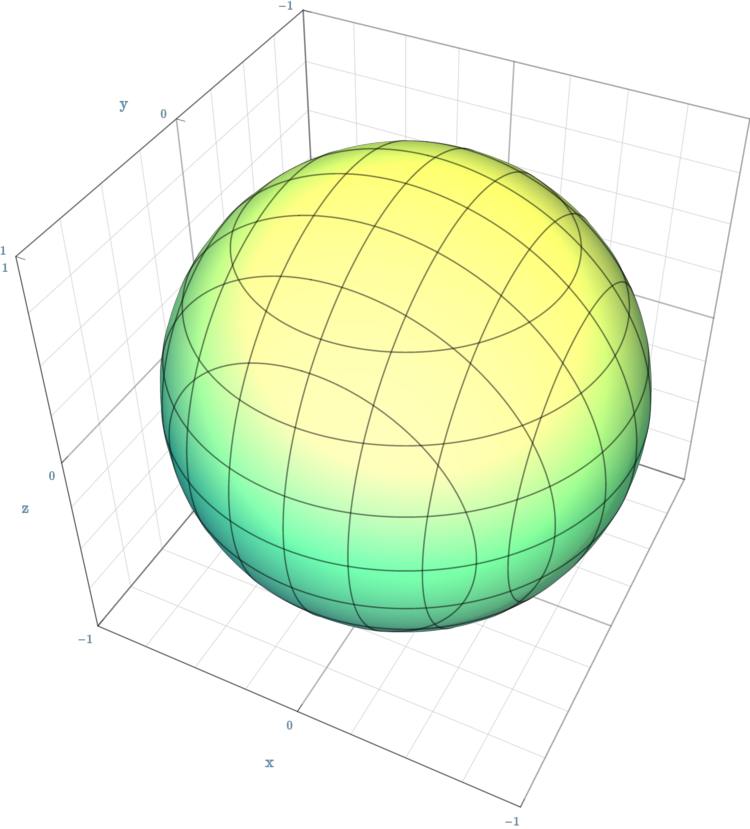
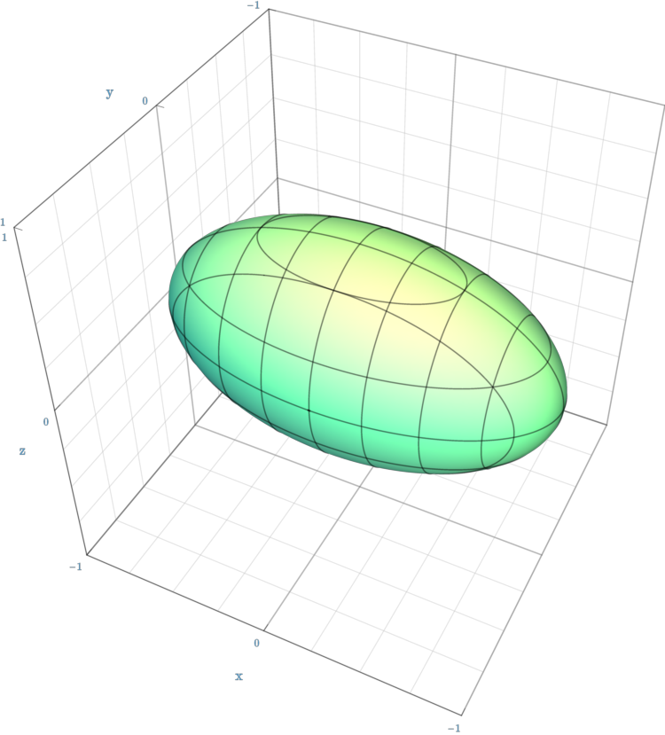
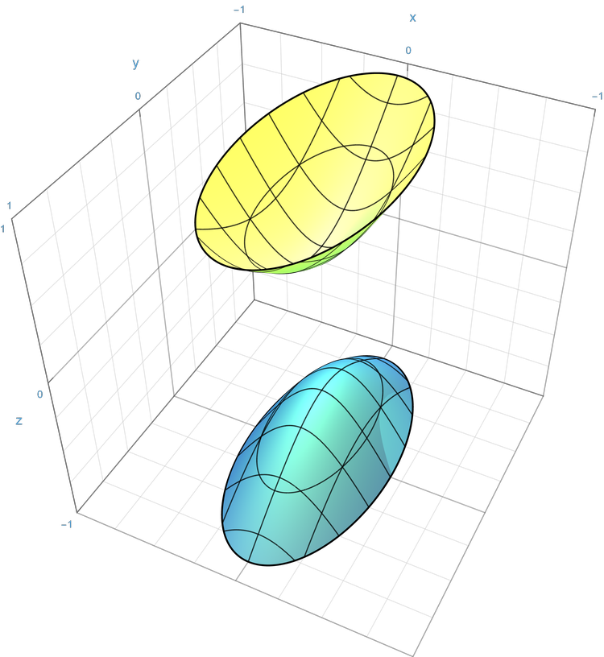
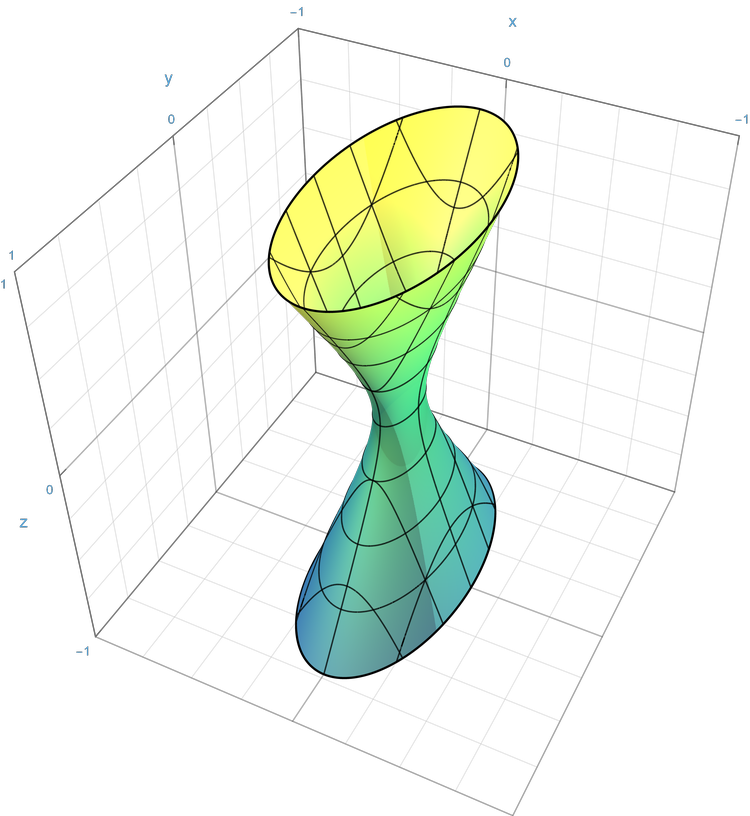
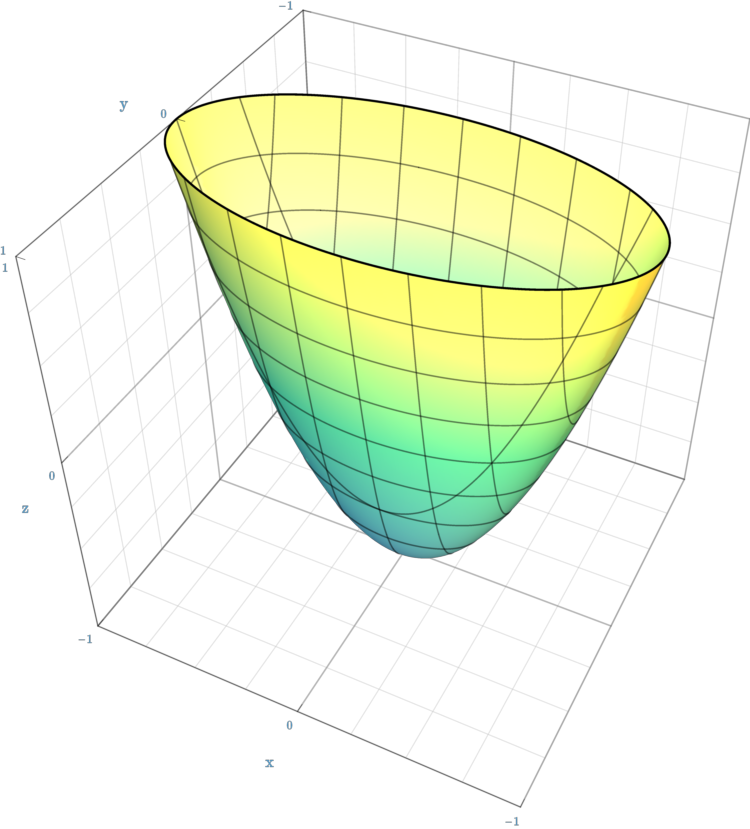
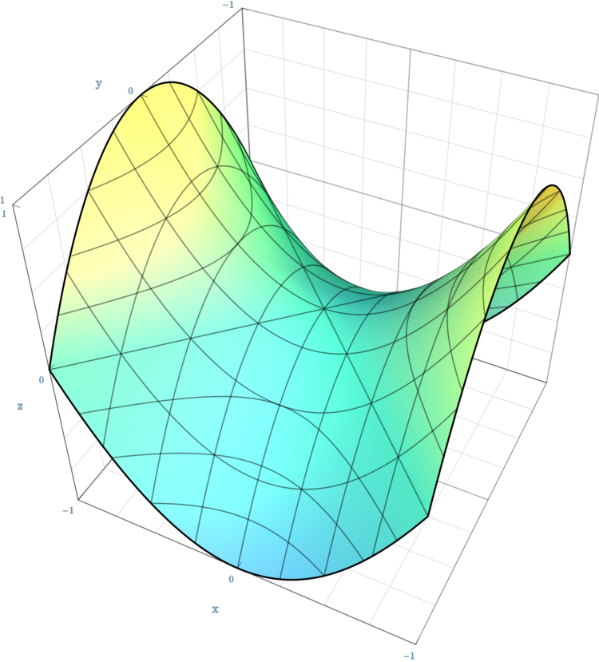
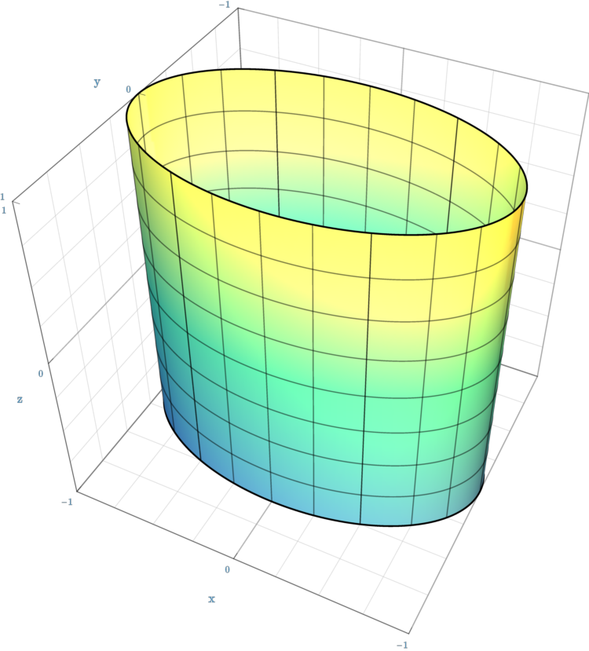
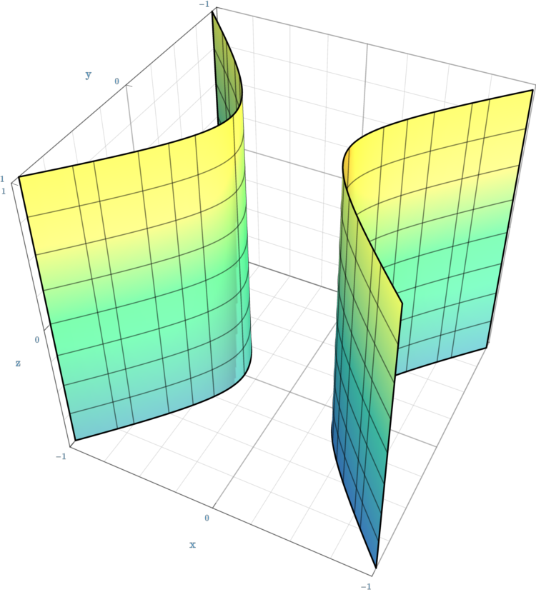
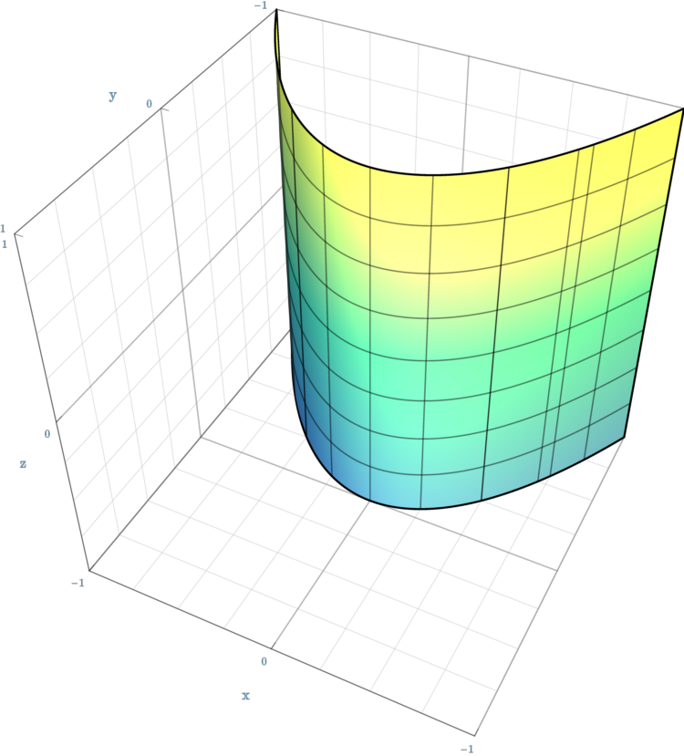
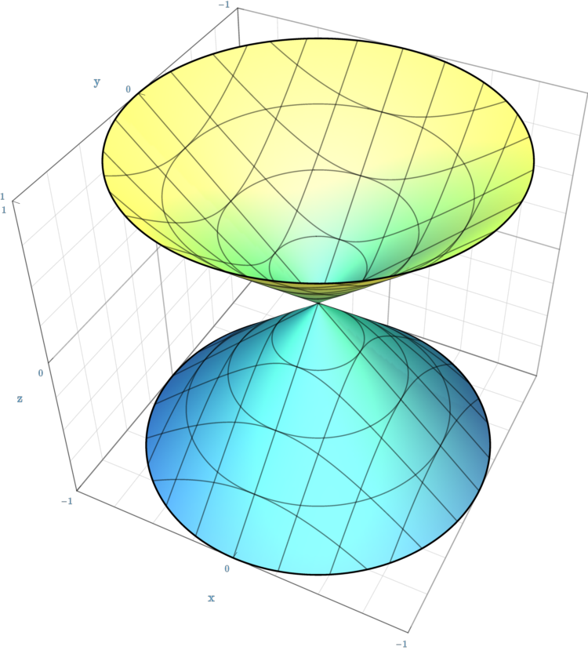

# Quadratic Function

[TOC]

## Define

> A quadratic function is a polynomial function whose highest-degree term has degree two.

$$
\begin{align*}
  f(x) &= a x^2 + b x + c  \tag{Univariate Quadratic}  \\
  f(\boldsymbol x) &= \boldsymbol x^T \boldsymbol A \boldsymbol x + \boldsymbol b \boldsymbol x + c  \tag{Multivariate}  \\
    &= \sum_{i=1}^{\dim} \sum_{j=1}^{\dim} a_{ij} · x_i x_j + \sum_{i=1}^{\dim} b_i x_i + c
\end{align*}
$$

## Properties

### Univariate Quadratic Equation  

A univariate quadratic equation has the form
$$
a x^2 + b x + c = 0
$$

- $a,b,c$ are constants and $a \neq 0$.

The solutions are given by
$$
\begin{align*}
  x &= \frac{- b \pm \sqrt{\Delta}}{2 a}  \tag{solutions}\\
  \Delta &= b^2 - 4 a c \tag{discriminant}
\end{align*}
$$
The discriminant determines the nature of the roots:

- $\Delta > 0$, There are two real roots.
- $\Delta = 0$, There is A real double root.
- $\Delta < 0$, There are two complex roots.

The relationship between roots provided by Vieta's formulas
$$
\left\{
\begin{aligned}
x_1 + x_2 &= -\frac{b}{a} \\
x_1x_2 &= \frac{c}{a}
\end{aligned}
\right. \tag{Vieta's formulas}
$$

the $x$-coordinate and the corresponding $y$-coordinate of the **vertex** is,
$$
\left(
-\frac{b}{2a},
-\frac{\Delta}{4a}
\right) \tag{vertex}
$$

- The vertex is a **minimum point** if $a>0$;

- The vertex is a **maximum point** if $a<0$.

### Quadric Surface, Quadratic Equation  

Quadric Surface is the zero set of a quadratic function,
$$
\begin{align*}
&\{ \boldsymbol x \ |\ \boldsymbol x^T \boldsymbol A \boldsymbol x + \boldsymbol b \boldsymbol x + c = 0\} \tag{Quadric Surface}\\
&\left\{ \boldsymbol x' \ |\ \boldsymbol x'^T \boldsymbol A' \boldsymbol x' = 0, \boldsymbol x' = \left(\begin{matrix} \boldsymbol x \\ 1 \end{matrix}\right)\right\}
\end{align*}
$$

- $\boldsymbol{x}\in\mathbb{R}^n, \boldsymbol{A}\in\mathbb{R}^{n\times n}, 
\boldsymbol{b}\in\mathbb{R}^n, c\in\mathbb{R}.$

#### Solutions

If $\boldsymbol A$ is invertible and symmetry, we can complete the solution of the quadratic equations. The center is,
$$
\boldsymbol{x}_0=-\frac12\boldsymbol{A}^{-1}\boldsymbol b.
$$
and the solutions are,
$$
(\boldsymbol{x}-\boldsymbol{x}_0)^T
\boldsymbol A
(\boldsymbol{x}-\boldsymbol{x}_0)
=
\frac14\boldsymbol b^T\boldsymbol A^{-1}\boldsymbol b-c
$$

$$
\boldsymbol x=-\frac12 \boldsymbol A^{-1} \boldsymbol b
+\sqrt{
\frac{\frac14 \boldsymbol b^T \boldsymbol A^{-1} \boldsymbol b- \boldsymbol c}{ \boldsymbol z^T \boldsymbol A \boldsymbol z}
}\, \boldsymbol z
$$

- $z\in\mathbb R^n\setminus\{0\}$

| Quadric                                                                          | $\boldsymbol A'$ such that ${\boldsymbol x'}^T\boldsymbol A'\boldsymbol x'=0$                                   |
| -------------------------------------------------------------------------------- | ------------------------------------------------------------------------------------------------------------------- |
| **Ellipsoid** $\frac{x^2}{a^2}+\frac{y^2}{b^2}+\frac{z^2}{c^2}=1$              | $\displaystyle \begin{pmatrix}\frac1{a^2}&0&0&0\\0&\frac1{b^2}&0&0\\0&0&\frac1{c^2}&0\\0&0&0&-1\end{pmatrix}$     |
| **Sphere** $x^2+y^2+z^2=r^2$                                                   | $\displaystyle \begin{pmatrix}1&0&0&0\\0&1&0&0\\0&0&1&0\\0&0&0&-r^2\end{pmatrix}$                                 |
| **One-sheet hyperboloid** $\frac{x^2}{a^2}+\frac{y^2}{b^2}-\frac{z^2}{c^2}=1$  | $\displaystyle \begin{pmatrix}\frac1{a^2}&0&0&0\\0&\frac1{b^2}&0&0\\0&0&-\frac1{c^2}&0\\0&0&0&-1\end{pmatrix}$    |
| **Two-sheet hyperboloid** $-\frac{x^2}{a^2}-\frac{y^2}{b^2}+\frac{z^2}{c^2}=1$ | $\displaystyle \begin{pmatrix}-\frac1{a^2}&0&0&0\\0&-\frac1{b^2}&0&0\\0&0&\frac1{c^2}&0\\0&0&0&-1\end{pmatrix}$   |
| **Elliptic cone** $\frac{x^2}{a^2}+\frac{y^2}{b^2}-\frac{z^2}{c^2}=0$          | $\displaystyle \begin{pmatrix}\frac1{a^2}&0&0&0\\0&\frac1{b^2}&0&0\\0&0&-\frac1{c^2}&0\\0&0&0&0\end{pmatrix}$     |
| **Elliptic paraboloid** $\frac{x^2}{a^2}+\frac{y^2}{b^2}-z=0$                  | $\displaystyle \begin{pmatrix}\frac1{a^2}&0&0&0\\0&\frac1{b^2}&0&0\\0&0&0&-\frac12\\0&0&-\frac12&0\end{pmatrix}$  |
| **Hyperbolic paraboloid** $\frac{x^2}{a^2}-\frac{y^2}{b^2}-z=0$                | $\displaystyle \begin{pmatrix}\frac1{a^2}&0&0&0\\0&-\frac1{b^2}&0&0\\0&0&0&-\frac12\\0&0&-\frac12&0\end{pmatrix}$ |
| **Elliptic cylinder** $\frac{x^2}{a^2}+\frac{y^2}{b^2}=1$                      | $\displaystyle \begin{pmatrix}\frac1{a^2}&0&0&0\\0&\frac1{b^2}&0&0\\0&0&0&0\\0&0&0&-1\end{pmatrix}$               |
| **Hyperbolic cylinder** $\frac{x^2}{a^2}-\frac{y^2}{b^2}=1$                    | $\displaystyle \begin{pmatrix}\frac1{a^2}&0&0&0\\0&-\frac1{b^2}&0&0\\0&0&0&0\\0&0&0&-1\end{pmatrix}$              |
| **Parabolic cylinder** $x^2/a^2-y=0$                                           | $\displaystyle \begin{pmatrix}\frac1{a^2}&0&0&0\\0&0&0&-\frac12\\0&0&0&0\\0&-\frac12&0&0\end{pmatrix}$            |

#### Sphere, Spherical Surface

For $\boldsymbol A = \boldsymbol I, \boldsymbol b = \boldsymbol 0, c = -r^2$ of a Quadratic Function,
$$
\begin{align*}
  &\{ \boldsymbol x \ |\ \|\boldsymbol x - \boldsymbol x_c\|_2 \le r < 0\}  \tag{Sphere}\\
\Leftrightarrow\quad &\{ \boldsymbol x \ |\ (\boldsymbol x - \boldsymbol x_c)^T (\boldsymbol x - \boldsymbol x_c) \le r^2 < 0\}  \\
\Leftrightarrow\quad &\{ \boldsymbol x_c + r \boldsymbol u \ |\ \|\boldsymbol u\|_2 \le r < 0\}
\end{align*}
$$

$$
\{ \boldsymbol x \ |\ \|\boldsymbol x - \boldsymbol x_c\|_2 = r \}  \tag{Spherical Surface}\\
$$

Spherical Surface is a point set with a constant distance value $r$ from the center point $\boldsymbol x_c$.

Property:
- Sphere is a convex set

#### Ellipsoid, Ellipsoid Surface

In a Quadratic Function, if $\boldsymbol A = \boldsymbol P^{-1}, \boldsymbol b = \boldsymbol 0, c = -1$ is a positive definite matrix, the zero set of the function is an Ellipsoid Surface,

$$
\begin{align*}
  &\left\{ \boldsymbol x \ |\ (\boldsymbol x - \boldsymbol x_c)^T \boldsymbol P^{-1} (\boldsymbol x - \boldsymbol x_c) \le 1, \boldsymbol P = \boldsymbol P^T ⪰ 0 \right\}  \tag{Ellipsoid}\\
  \Leftrightarrow\quad &\{ \boldsymbol x_c + \boldsymbol A \boldsymbol u \ |\ \|\boldsymbol u\|_2 \le 1\}
\end{align*}
$$

$$
\{ \boldsymbol x \ |\ (\boldsymbol x - \boldsymbol x_c)^T \boldsymbol P^{-1} (\boldsymbol x - \boldsymbol x_c) = 1, \boldsymbol P = \boldsymbol P^T ⪰ 0\}  \tag{Ellipsoid Surface}
$$

Property:

- Ellipsoid is a convex set

For ellipse,

- Semi-major axis $2a$, $a$ is the distance from the center to a vertex along the longer axis.
- Semi-minor axis $2b$, $b$ is the distance from the center to a co-vertex along the shorter axis.
- Foci
  - The distance from the center to each focus is $c = \sqrt{a^2 - b^2}$.
  - For any point $P$ on the ellipse $PF_1 + PF_2 = 2a$
- Eccentricity, The eccentricity describes how stretched the ellipse is. $e = \frac ca \in (0,1)$
- Area $S = \pi ab$
- Circumference 
  - Ramanujan’s first approximation $C\approx \pi\left[3(a+b)-\sqrt{(3a+b)(a+3b)}\right]$
  - Ramanujan’s second approximation $C\approx\pi(a+b)\left(1+\frac{3h}{10+\sqrt{4-3h}}\right), h=\left(\frac{a-b}{a+b}\right)^2$

#### Hyperboloid

if $\boldsymbol A$ is a non-positive definite matrix. Hyperboloid of one sheet, Hyperboloid of two sheets, Conical surface in between

#### Paraboloid

#### Cylinder

#### Cone

